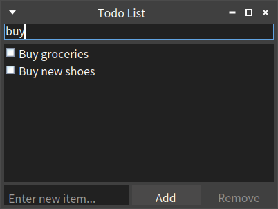
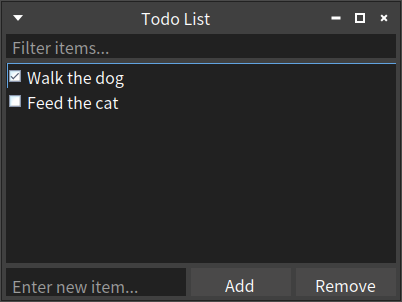

# smalltalk-dev-plugin: To-do list built with Spec2 framework

This repository showcases a project created by [smalltalk-dev-plugin](https://github.com/mumez/smalltalk-dev-plugin) — a Claude Code extension for Pharo Smalltalk development.

Even interactive GUI programming is possible with this plugin. First, a simple to-do list using the Spec2 framework was requested. After the initial implementation, a filter field was requested as an additional feature, and `/st:buddy` revised the implementation accordingly.
Since `/st:buddy` can read Pharo screenshots, it understands the to-do list's appearance and behavior directly from the running application.
Later, a bug was found — the Remove button was not being enabled even when a checked item was selected. The session was resumed for debugging, and `/st:buddy` successfully fixed the issue.

You can watch the actual development process in the video below.

[](https://youtu.be/9jinoL4bNDs)

## Prompt

The following prompt was given to `/st:buddy`:

```
/st:buddy I want to make a simple to-do list using the Spec2 framework.
Include a checkbox for each item, plus an input field with Add/Remove buttons at the bottom. Only checked items can be removed.
Start developing.
```

After the initial implementation, `/st:buddy` asked:
```
Would you like me to add any additional features, such as persistence, editing items, or keyboard shortcuts?
```

So the following second request was made:
```
Add a filter field for filtering items.
```

`/st:buddy` revised the implementation and confirmed that the filter field was added by reopening the to-do list window.

At this stage, a bug was discovered: the Remove button was not being enabled when a checked item was selected. The session was resumed with the following debugging request:
```
The remove button is not active even if the checked item is selected.
```

`/st:buddy` successfully fixed the bug after a few iterations.

## Generated Source

The source code is in the [src](./src) directory.

The `TodoList` package contains three classes:

- **TodoItem** — A simple model representing a to-do item with `text` and `checked` state.
- **TodoItemPresenter** — A Spec2 presenter that displays a single to-do item as a checkbox. It wraps a `TodoItem` model and notifies the parent when the check state changes.
- **TodoListPresenter** — The main Spec2 presenter that manages the entire to-do list UI. It provides an item list with checkboxes, a text input with Add/Remove buttons, and a filter field for searching items. Open it with `TodoListPresenter open`.

## Screenshots

| Filtering items | Remove button enabled for checked items |
|:-:|:-:|
|  |  |

## Try It in Pharo

To try the generated source code in a live Pharo environment, load the `TodoList` project using Metacello:

```smalltalk
Metacello new
  baseline: 'TodoList';
  repository: 'github://mumez/smalltalk-dev-plugin-gui-example:loader/src';
  load.
```

> **Note:** The full project structure (Baseline class and project metadata) was not part of the original generated output — it was added afterward to enable loading via Metacello. The `loader` branch is specified for this purpose.

Then open the TodoList from a Playground:

```smalltalk
TodoListPresenter open.
```

## License

[MIT](LICENSE)